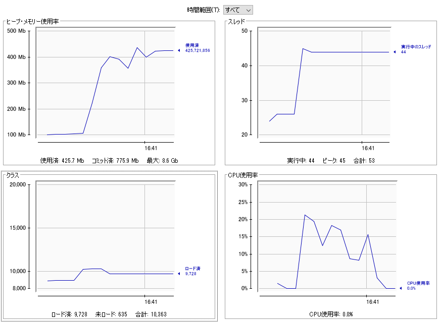
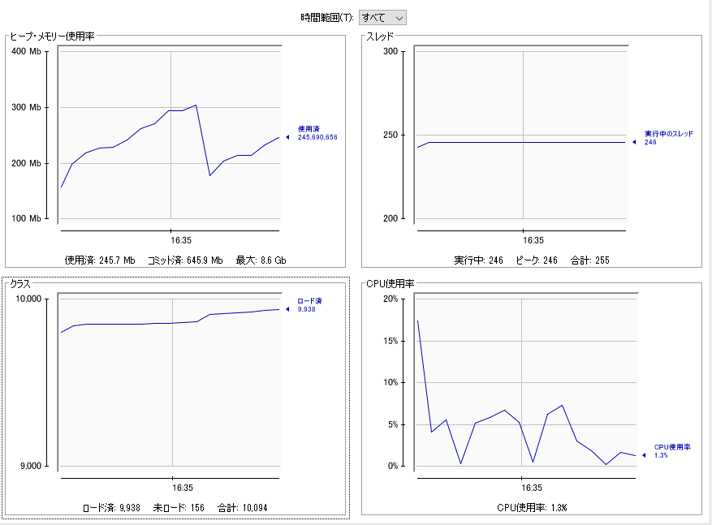

# Spring WebFlux + OpenAPI + MyBatis sample
- [Spring WebFlux](https://docs.spring.io/spring/docs/current/spring-framework-reference/web-reactive.html#spring-webflux)
- [OpenAPI](https://github.com/OAI/OpenAPI-Specification/blob/master/versions/3.0.1.md)
- [MyBatis](http://www.mybatis.org/mybatis-3/)


# Load testing
## Spring WebFlux
1. mvnw spring-boot:run
1. mvnw gatling:test

## Spring Web MVC
1. mvnw -P web spring-boot:run
1. mvnw -P web gatling:test

#  Load test results
## Spring WebFlux
```
================================================================================
---- Global Information --------------------------------------------------------
> request count                                       6000 (OK=6000   KO=0     )
> min response time                                   5002 (OK=5002   KO=-     )
> max response time                                   5587 (OK=5587   KO=-     )
> mean response time                                  5011 (OK=5011   KO=-     )
> std deviation                                         50 (OK=50     KO=-     )
> response time 50th percentile                       5004 (OK=5004   KO=-     )
> response time 75th percentile                       5005 (OK=5005   KO=-     )
> response time 95th percentile                       5016 (OK=5016   KO=-     )
> response time 99th percentile                       5323 (OK=5323   KO=-     )
> mean requests/sec                                166.667 (OK=166.667 KO=-     )
---- Response Time Distribution ------------------------------------------------
> t < 800 ms                                             0 (  0%)
> 800 ms < t < 1200 ms                                   0 (  0%)
> t > 1200 ms                                         6000 (100%)
> failed                                                 0 (  0%)
================================================================================
```


## Spring Web MVC
```
================================================================================
---- Global Information --------------------------------------------------------
> request count                                       6000 (OK=2800   KO=3200  )
> min response time                                   5004 (OK=5004   KO=60000 )
> max response time                                  60007 (OK=57488  KO=60007 )
> mean response time                                 46560 (OK=31199  KO=60001 )
> std deviation                                      18122 (OK=16166  KO=1     )
> response time 50th percentile                      60000 (OK=30669  KO=60001 )
> response time 75th percentile                      60001 (OK=45238  KO=60001 )
> response time 95th percentile                      60001 (OK=57132  KO=60001 )
> response time 99th percentile                      60002 (OK=57412  KO=60002 )
> mean requests/sec                                 65.934 (OK=30.769 KO=35.165)
---- Response Time Distribution ------------------------------------------------
> t < 800 ms                                             0 (  0%)
> 800 ms < t < 1200 ms                                   0 (  0%)
> t > 1200 ms                                         2800 ( 47%)
> failed                                              3200 ( 53%)
---- Errors --------------------------------------------------------------------
> i.g.h.c.i.RequestTimeout$RequestTimeoutException: Request time   3200 (100.0%)
out to localhost/127.0.0.1:80 after 60000 ms
================================================================================
```
